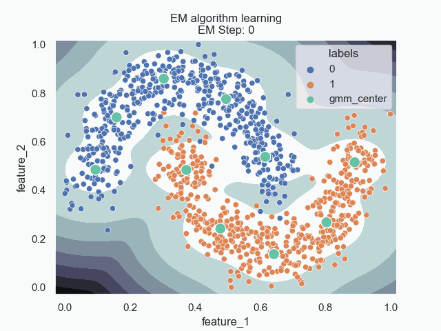

# RbfNN_CCU
Adapting certified certain uncertainty (CCU) [robust model](https://github.com/AlexMeinke/certified-certain-uncertainty)
from [Towards neural networks that provably know when they don't know](https://openreview.net/forum?id=ByxGkySKwH) 

A natural extension which makes use of a mathematical machinery similar to Gaussian Mixture Models (GMM) is the 
radial basis function (RBF) neural networks where we will build from [Alessio Russo](https://github.com/rssalessio/PytorchRBFLayer)

Goal is to integrate RBF layer with Robust model sharing RBF and GMM computation for efficiency.
The CCU is able to reduce confidence far from the expected input distance from a Multi-layer-perceptron (MLP). We will illustrate this 
using SKlearns two moons data set for a non-linear decision boundary.

*Where we can see on the left the base MLP has high confidence in the feature space far from the decision boundary.* 

RBFNNs also mirror the high confidence far from the decision boundary, but use their radial basis functions to determine
how to define decision boundaries. 

The RBFNNs do not learn to map the density in the same way as the GMMs. They place their centers based on where optimizes
learning decision boundaries. The following plot will show the centers of the RBF and GMMs as well as their learned kernels.

To illustrate this further I will show the learning process of the RBF kernels and GMM likelihood both with 10 centers 
on our two moons data set. 

### RBF Learning Kernels

### GMM Learning in EM

Where from the above we can see that the RBF kernels do not have the stability seen from the EM algorithm. This comes 
the two competing optimizations. 

Implement beyond spherical variance for clusters and modify distance metrics. 
